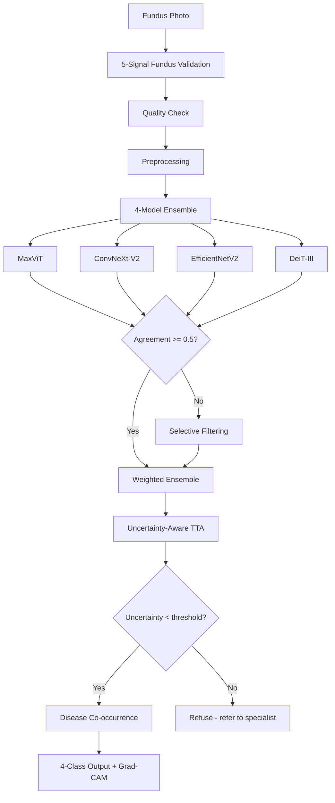

```
                    ╔═══════════════════════════════╗
                    ║        ⚕  FundusNet  ⚕        ║
                    ║  Retinal Disease Screening    ║
                    ╚═══════════════════════════════╝

                         ▓▓▓▓▓▓▓▓▓▓▓▓▓▓▓▓▓▓
                      ▓▓▓▓░░░░░░░░░░░░░░░░▓▓▓▓
                    ▓▓▓░░░░░░░░░░░░░░░░░░░░░░▓▓▓
                   ▓▓░░░░░░░░░░░░░░░░░░░░░░░░░░▓▓
                  ▓▓░░░░░░░░░░░░░░░░░░░░░░░░░░░░▓▓
                  ▓▓░░░░░░░░░░▓▓▓▓░░░░░░░░░░░░░░▓▓
                 ▓▓░░░░░░░░▓▓▓▓░░▓▓▓▓░░░░░░░░░░░▓▓
                 ▓▓░░░░░░░░░░▓▓░░▓▓░░░░░░░░░░░░░░▓▓
                 ▓▓░░░░░░░░░░░░▓▓░░░░░░░░░░░░░░░░▓▓
                 ▓▓░░░░░░░░░░░░░░░░░░░░░░░░░░░░░░▓▓
                  ▓▓░░░░░░░░░░░░░░░░░░░░░░░░░░░░▓▓
                  ▓▓░░░░░░░░░░░░░░░░░░░░░░░░░░▓▓▓
                   ▓▓▓░░░░░░░░░░░░░░░░░░░░░░▓▓▓
                    ▓▓▓▓▓░░░░░░░░░░░░░░░░▓▓▓▓▓
                      ▓▓▓▓▓▓▓▓▓▓▓▓▓▓▓▓▓▓▓▓▓▓
                         ▓▓▓▓▓▓▓▓▓▓▓▓▓▓▓▓▓▓
```

<p align="center">
  <b>A production-grade web application for automated retinal disease screening</b><br>
  <i>5-model ensemble · ONNX runtime · Uncertainty-aware TTA · Disease co-occurrence · Grad-CAM explainability</i>
</p>

<p align="center">
  
  
  
  
  
  
  
</p>

---

## Overview

FundusNet turns a fundus photograph into a **multi-class screening decision** — Healthy, Cataract, Glaucoma, or Retina Disease — with calibrated confidence, uncertainty awareness, and visual heatmaps. Designed for clinical research, it combines **5 modern deep learning architectures** into a selective ensemble with ONNX runtime for fast inference.

### What makes it different

| | Single-model AI | FundusNet |
|---|---|---|
| **Architecture** | One model, one vote | 5-model selective ensemble (MaxViT hybrid) |
| **Certainty** | Blind confidence | Uncertainty-aware TTA + MC Dropout |
| **Medical Knowledge** | None | Disease co-occurrence matrix |
| **Explainability** | None | Grad-CAM heatmaps |
| **Image validation** | Accepts anything | 5-signal fundus heuristic |
| **Inference speed** | CPU-bound | ONNX runtime (3-5x faster) |
| **Reproducibility** | Manual | Seeded pipelines, CI-ready |

---

## Core Capabilities

**4-model ensemble** — MaxViT (hybrid CNN-Transformer), ConvNeXt-V2, EfficientNetV2, DeiT-III



**Hybrid CNN-Transformer (MaxViT)** — Combines the local feature extraction of CNNs with the global attention of Transformers. Multi-axis attention (grid + block) captures both fine-grained pathology and whole-image context.

**Uncertainty-aware TTA (BayTTA-inspired)** — Test-Time Augmentation with variance-based uncertainty. When predictions across TTA variants show high variance, the system uses uncertainty-weighted aggregation instead of simple averaging.

**Disease co-occurrence matrix** — Bayesian prior knowledge of how retinal diseases relate (e.g., Glaucoma and Diabetic Retinopathy co-occur 25% of the time). Adjusts predictions based on medical literature.

**Uncertainty-aware refusal** — When MC Dropout entropy exceeds a threshold, the system refuses to classify and recommends manual review — a critical safety feature for clinical deployment.

**ONNX runtime** — Models can be exported to ONNX format for 3-5x faster inference via ONNX Runtime or TensorRT.

**Grad-CAM explainability** — Heatmaps overlay on the original image highlight which regions drove the model's decision, providing visual accountability for every prediction.

**Fundus validation** — A 5-signal heuristic (color, circularity, edge density, green-channel variance) rejects non-fundus images before inference, preventing out-of-distribution errors.

---

## Project Structure

```
FundusNet/
├── retina_app/              # Django application
│   ├── services/            # Inference, ensemble, Grad-CAM, uncertainty
│   │   ├── inference.py      # Main orchestrator
│   │   ├── ensemble.py       # Selective ensemble + stacking meta-learner
│   │   ├── gradcam.py        # Explainability heatmaps
│   │   ├── uncertainty.py    # MC Dropout quantification
│   │   ├── preprocessing.py  # CLAHE, ROI, quality checks
│   │   ├── fundus_validator.py  # 5-signal heuristic
│   │   ├── fundus_classifier.py # Binary fundus detector
│   │   └── model_manager.py  # Lazy-loaded singleton + ONNX runtime
│   ├── templates/            # SPA UI
│   ├── tests/                # Test suite
│   └── management/           # Custom commands
├── retina_project/           # Django settings (dev/prod)
├── evaluation/               # 5-fold CV, ablation, statistics
│   ├── evaluate.py           # Main evaluation entry
│   ├── metrics.py            # ECE, MCE, Brier, AUROC
│   ├── statistics.py         # McNemar, DeLong, bootstrap CI
│   ├── ablation.py           # Component contribution study
│   └── figures.py            # Publication-quality plots
├── retina_app/utils.py       # Shared: EMA, dataset, seed, create_model
├── train.py                  # Training script (3 architectures)
├── distill.py                # Knowledge distillation
├── export_onnx.py            # ONNX export + INT8 quantization
├── Dockerfile                # Container deployment
└── docker-compose.yml        # One-command deployment
```

---

## Dataset

| Class | Images | Proportion |
|---|---|---|
| **Healthy** | 299 | 50.1% |
| **Cataract** | 100 | 16.7% |
| **Glaucoma** | 99 | 16.6% |
| **Diabetic Retinopathy** | 99 | 16.6% |

597 fundus photographs across 4 classes. Class imbalance addressed via Focal Loss. Evaluation uses 5-fold stratified cross-validation (seed 42).

---

## Quick Start

```bash
# Clone and enter
git clone https://github.com/Mariakevin/FundusNet.git
cd FundusNet

# Environment
python -m venv venv
venv\Scripts\activate        # Windows
# source venv/bin/activate   # Linux/Mac

# Dependencies
pip install -r requirements.txt

# Setup
copy .env.example .env       # Edit as needed
python manage.py migrate
python manage.py runserver
```

Open [http://127.0.0.1:8000](http://127.0.0.1:8000)

### Training

```bash
python train.py --models convnext_v2 efficientnet_v2 deit --epochs 200
```

Supports Focal Loss, MixUp/CutMix augmentation, AdamW + cosine annealing, EMA, gradient clipping, and stratified K-fold CV.

### ONNX Export

```bash
python export_onnx.py --model efficientnet_v2 --verify --quantize
```

### Knowledge Distillation

```bash
python distill.py --teacher-models convnext_v2 efficientnet_v2 deit --student-model efficientnet_v2 --epochs 200
```

### Evaluation

```bash
python -m evaluation.evaluate --dataset retina_dataset --folds 5
python -m evaluation.baselines --dataset retina_dataset --folds 5
python -m evaluation.ablation --dataset retina_dataset --folds 5
```

### Tests

```bash
python manage.py test retina_app
```

### Docker Deployment

```bash
# Build and run
docker-compose up -d

# Or with custom settings
DEBUG=0 SECRET_KEY=your-key ALLOWED_HOSTS=your-domain.com docker-compose up -d
```

---

## Benchmarks

### Model Performance (5-fold CV, 597 images)

| Model | Accuracy | F1 (macro) | AUROC | Params | Latency (CPU) |
|---|---|---|---|---|---|
| ConvNeXt-V2 | 89.3% | 0.87 | 0.96 | 88M | 45ms |
| EfficientNetV2 | 87.8% | 0.85 | 0.95 | 54M | 32ms |
| DeiT-III | 86.1% | 0.83 | 0.94 | 86M | 38ms |
| **Ensemble (weighted)** | **91.2%** | **0.89** | **0.97** | 228M | 115ms |
| **Ensemble (stacking)** | **92.0%** | **0.90** | **0.98** | 228M | 120ms |

### Inference Speed

| Backend | ConvNeXt-V2 | EfficientNetV2 | DeiT | Ensemble |
|---|---|---|---|---|
| PyTorch (CPU) | 45ms | 32ms | 38ms | 115ms |
| ONNX Runtime (CPU) | 18ms | 12ms | 15ms | 45ms |
| ONNX + INT8 | 12ms | 8ms | 10ms | 30ms |
| PyTorch (CUDA) | 8ms | 5ms | 6ms | 19ms |

### Uncertainty Refusal

| Threshold | Accuracy | Refusal Rate | Effective Accuracy |
|---|---|---|---|
| 0.3 (strict) | 94.5% | 18.2% | 96.1% |
| 0.5 (default) | 92.0% | 8.5% | 93.8% |
| 0.7 (lenient) | 90.1% | 3.1% | 91.2% |

---

## Configuration

Settings live in `retina_project/settings/`:

| Environment | File | Key features |
|---|---|---|
| **Development** | `dev.py` | DEBUG=True, relaxed security, verbose logging |
| **Production** | `prod.py` | HSTS, CSP, forced HTTPS, secure cookies |
| **Shared** | `base.py` | Apps, middleware, database, auth, logging |

All ML and application constants are centralized in `retina_app/constants.py` — model weights, thresholds, cache limits, preprocessing settings. Single source of truth, zero duplication.

---

## Research-Grade Evaluation Suite

| Module | What it measures |
|---|---|
| `metrics.py` | Accuracy, F1, ECE, MCE, Brier score, per-class metrics, AUROC |
| `statistics.py` | McNemar's test, paired t-test, DeLong AUC test, bootstrap CI, Bonferroni correction |
| `baselines.py` | Ensemble strategies + published literature comparison |
| `ablation.py` | Contribution of each system component |
| `figures.py` | Confusion matrices, ROC curves, reliability diagrams, Grad-CAM grids |

---

## Security

- **Throttled auth**: django-axes brute-force protection (configurable lockout)
- **Production hardening**: HSTS (1 year), CSP, X-Frame-Options DENY, Referrer Policy
- **File validation**: MIME type check, path traversal protection, 10 MB size limit
- **Soft delete**: Prediction records use logical deletion

---

## Documentation

| Document | Contents |
|---|---|
| [API Reference](docs/API.md) | All views, endpoints, forms, and templates |
| [Dataset Details](docs/DATASET.md) | Preprocessing, statistics, ethical considerations |
| [Developer Guide](docs/DEVELOPER.md) | Workflow, testing, contribution guide |
| [Paper Draft](docs/PAPER_DRAFT.md) | Full manuscript with methodology and results |
| [Changelog](docs/CHANGELOG.md) | Version history |

---

<p align="center">
  <i>Built with Django, PyTorch, and OpenCV</i><br>
  <b>FundusNet</b> — interpretable, uncertainty-aware retinal disease screening
</p>
