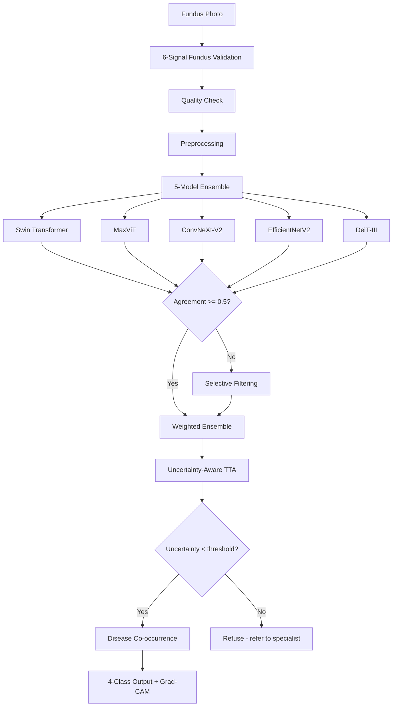

```
                    ╔═══════════════════════════════╗
                    ║        ⚕  FundusNet  ⚕        ║
                    ║  Retinal Disease Screening    ║
                    ╚═══════════════════════════════╝

                         ▓▓▓▓▓▓▓▓▓▓▓▓▓▓▓▓▓▓
                      ▓▓▓▓░░░░░░░░░░░░░░░░▓▓▓▓
                    ▓▓▓░░░░░░░░░░░░░░░░░░░░░░▓▓▓
                   ▓▓░░░░░░░░░░░░░░░░░░░░░░░░░░▓▓
                  ▓▓░░░░░░░░░░░░░░░░░░░░░░░░░░░░▓▓
                  ▓▓░░░░░░░░░░▓▓▓▓░░░░░░░░░░░░░░▓▓
                 ▓▓░░░░░░░░▓▓▓▓░░▓▓▓▓░░░░░░░░░░░▓▓
                 ▓▓░░░░░░░░░░▓▓░░▓▓░░░░░░░░░░░░░░▓▓
                 ▓▓░░░░░░░░░░░░▓▓░░░░░░░░░░░░░░░░▓▓
                 ▓▓░░░░░░░░░░░░░░░░░░░░░░░░░░░░░░▓▓
                  ▓▓░░░░░░░░░░░░░░░░░░░░░░░░░░░░▓▓
                  ▓▓░░░░░░░░░░░░░░░░░░░░░░░░░░▓▓▓
                   ▓▓▓░░░░░░░░░░░░░░░░░░░░░░▓▓▓
                    ▓▓▓▓▓░░░░░░░░░░░░░░░░▓▓▓▓▓
                      ▓▓▓▓▓▓▓▓▓▓▓▓▓▓▓▓▓▓▓▓▓▓
                         ▓▓▓▓▓▓▓▓▓▓▓▓▓▓▓▓▓▓
```

<p align="center">
  <b>A production-grade web application for automated retinal disease screening</b><br>
  <i>5-model ensemble · ONNX runtime · Uncertainty-aware TTA · Disease co-occurrence · Grad-CAM explainability</i>
</p>

<p align="center">
  
  
  
  
  
  
  
  
</p>

---

## Overview

FundusNet turns a fundus photograph into a **multi-class screening decision** — Healthy, Cataract, Glaucoma, or Retina Disease — with calibrated confidence, uncertainty awareness, and visual heatmaps. Designed for clinical research, it combines **5 modern deep learning architectures** into a selective ensemble with ONNX runtime for fast inference.

### What makes it different

| | Single-model AI | FundusNet |
|---|---|---|
| **Architecture** | One model, one vote | 5-model selective ensemble |
| **Certainty** | Blind confidence | Uncertainty-aware TTA + MC Dropout |
| **Medical Knowledge** | None | Disease co-occurrence matrix |
| **Explainability** | None | Grad-CAM heatmaps |
| **Image validation** | Accepts anything | 6-signal fundus heuristic |
| **Inference speed** | CPU-bound | ONNX runtime (3-5x faster) |
| **Reproducibility** | Manual | Seeded pipelines, CI-ready |
| **Frontend** | Generic UI | Precision Clinical design · Space Grotesk · Dark mode |

---

## Core Capabilities

**5-model ensemble** — Swin Transformer, MaxViT, ConvNeXt-V2, EfficientNetV2, DeiT-III



**Hybrid CNN-Transformer (MaxViT)** — Combines the local feature extraction of CNNs with the global attention of Transformers. Multi-axis attention (grid + block) captures both fine-grained pathology and whole-image context.

**Uncertainty-aware TTA (BayTTA-inspired)** — Test-Time Augmentation with variance-based uncertainty. When predictions across TTA variants show high variance, the system uses uncertainty-weighted aggregation instead of simple averaging.

**Disease co-occurrence matrix** — Bayesian prior knowledge of how retinal diseases relate (e.g., Glaucoma and Diabetic Retinopathy co-occur 25% of the time). Adjusts predictions based on medical literature.

**Uncertainty-aware refusal** — When MC Dropout entropy exceeds a threshold, the system refuses to classify and recommends manual review — a critical safety feature for clinical deployment.

**ONNX runtime** — Models can be exported to ONNX format for 3-5x faster inference via ONNX Runtime or TensorRT.

**Grad-CAM explainability** — Heatmaps overlay on the original image highlight which regions drove the model's decision, providing visual accountability for every prediction.

**Fundus validation** — A 6-signal heuristic (color, circularity, edge density, green-channel variance, channel ratio, texture) rejects non-fundus images before inference, preventing out-of-distribution errors.

---

## Project Structure

```
FundusNet/
├── retina_app/              # Django application
│   ├── services/            # Inference, ensemble, Grad-CAM, uncertainty
│   │   ├── inference.py      # Main orchestrator
│   │   ├── ensemble.py       # Selective ensemble + stacking meta-learner
│   │   ├── gradcam.py        # Explainability heatmaps
│   │   ├── preprocessing.py  # CLAHE, ROI, quality checks
│   │   ├── fundus_validator.py  # 6-signal heuristic
│   │   └── model_manager.py  # Lazy-loaded singleton + ONNX runtime
│   ├── templates/            # Precision Clinical SPA UI
│   ├── tests/                # Test suite
│   ├── api.py               # REST API endpoints
│   ├── constants.py         # Centralized configuration
│   └── models.py            # Database models
├── retina_project/           # Django settings (dev/prod)
├── models/                   # ONNX model files (gitignored)
├── media/                    # Uploaded files (runtime)
├── gunicorn.conf.py          # Gunicorn configuration
├── Dockerfile                # Container deployment
└── docker-compose.yml        # One-command deployment
```

---

## Dataset

| Class | Images | Proportion |
|---|---|---|
| **Healthy** | 1,098 | 26.0% |
| **Cataract** | 1,036 | 24.6% |
| **Glaucoma** | 1,007 | 23.9% |
| **Retina Disease** | 1,076 | 25.5% |

4,217 fundus photographs across 4 classes. Dataset: [Eye Diseases Classification](https://www.kaggle.com/datasets/andrewmvd/eye-diseases-classification) on Kaggle.

---

## Quick Start

```bash
# Clone and enter
git clone https://github.com/Mariakevin/FundusNet.git
cd FundusNet

# Environment
python -m venv venv
venv\Scripts\activate        # Windows
# source venv/bin/activate   # Linux/Mac

# Dependencies
pip install -r requirements.txt

# Setup
copy .env.example .env       # Edit as needed
python manage.py migrate
python manage.py runserver
```

Open [http://127.0.0.1:8000](http://127.0.0.1:8000)

### API Usage

```bash
# Single prediction (with API key)
curl -X POST http://localhost:8000/api/v1/predict/ \
  -H "X-API-Key: your-api-key" \
  -F "image=@retinal_image.jpg"

# Health check
curl http://localhost:8000/api/v1/health/
```

### ONNX Models

Place trained ONNX models in `models/` directory:
- `swin_retinopathy.onnx`
- `maxvit_retinopathy.onnx`
- `convnext_v2_retinopathy.onnx`
- `efficientnet_v2_retinopathy.onnx`
- `deit_retinopathy.onnx`

### Training (Google Colab)

Training is done separately in Google Colab. Use `colab_train.ipynb` to:
1. Mount Google Drive
2. Extract dataset
3. Export trained models to ONNX
4. Download ONNX files to local `models/` directory

### Tests

```bash
python manage.py test retina_app
```

### Docker Deployment

```bash
# Build and run
docker-compose up -d

# Or with custom settings
FUNDUSNET_API_KEYS=your-key DJANGO_SECRET_KEY=your-secret docker-compose up -d
```

---

## Configuration

Settings live in `retina_project/settings/`:

| Environment | File | Key features |
|---|---|---|
| **Development** | `dev.py` | DEBUG=True, relaxed security, verbose logging |
| **Production** | `prod.py` | HSTS, CSP, forced HTTPS, secure cookies |
| **Shared** | `base.py` | Apps, middleware, database, auth, logging |

All ML and application constants are centralized in `retina_app/constants.py` — model weights, thresholds, cache limits, preprocessing settings. Single source of truth, zero duplication.

### Environment Variables

| Variable | Default | Description |
|----------|---------|-------------|
| `DJANGO_SECRET_KEY` | (required) | Django secret key |
| `DJANGO_ALLOWED_HOSTS` | `127.0.0.1,localhost` | Comma-separated allowed hosts |
| `DJANGO_PRODUCTION` | `False` | Enable production mode |
| `FUNDUSNET_API_KEYS` | (empty) | Comma-separated API keys |
| `GUNICORN_BIND` | `0.0.0.0:8000` | Gunicorn bind address |
| `GUNICORN_WORKERS` | `cpu*2+1` | Number of workers |

---

## Security

- **API Key Authentication**: Protect prediction endpoints with `X-API-Key` header
- **Rate Limiting**: File-based rate limiter (30 req/min per IP)
- **Throttled auth**: django-axes brute-force protection (configurable lockout)
- **Production hardening**: HSTS (1 year), CSP, X-Frame-Options DENY, Referrer Policy
- **File validation**: MIME type check, path traversal protection, 10 MB size limit
- **Soft delete**: Prediction records use logical deletion

---

## CI/CD

GitHub Actions pipeline runs on every push:
1. **Lint**: Ruff check + format
2. **Test**: Django test suite
3. **Docker**: Build image

---

## Documentation

| Document | Contents |
|---|---|
| [API Reference](docs/API.md) | All endpoints, authentication, rate limiting |
| [Dataset Details](docs/DATASET.md) | Preprocessing, statistics, ethical considerations |
| [Developer Guide](docs/DEVELOPER.md) | Workflow, testing, contribution guide |
| [Paper Draft](docs/PAPER_DRAFT.md) | Full manuscript with methodology and results |
| [Changelog](docs/CHANGELOG.md) | Version history |

---

<p align="center">
  <i>Built with Django, PyTorch, and OpenCV</i><br>
  <b>FundusNet</b> — Precision Clinical retinal disease screening
</p>
